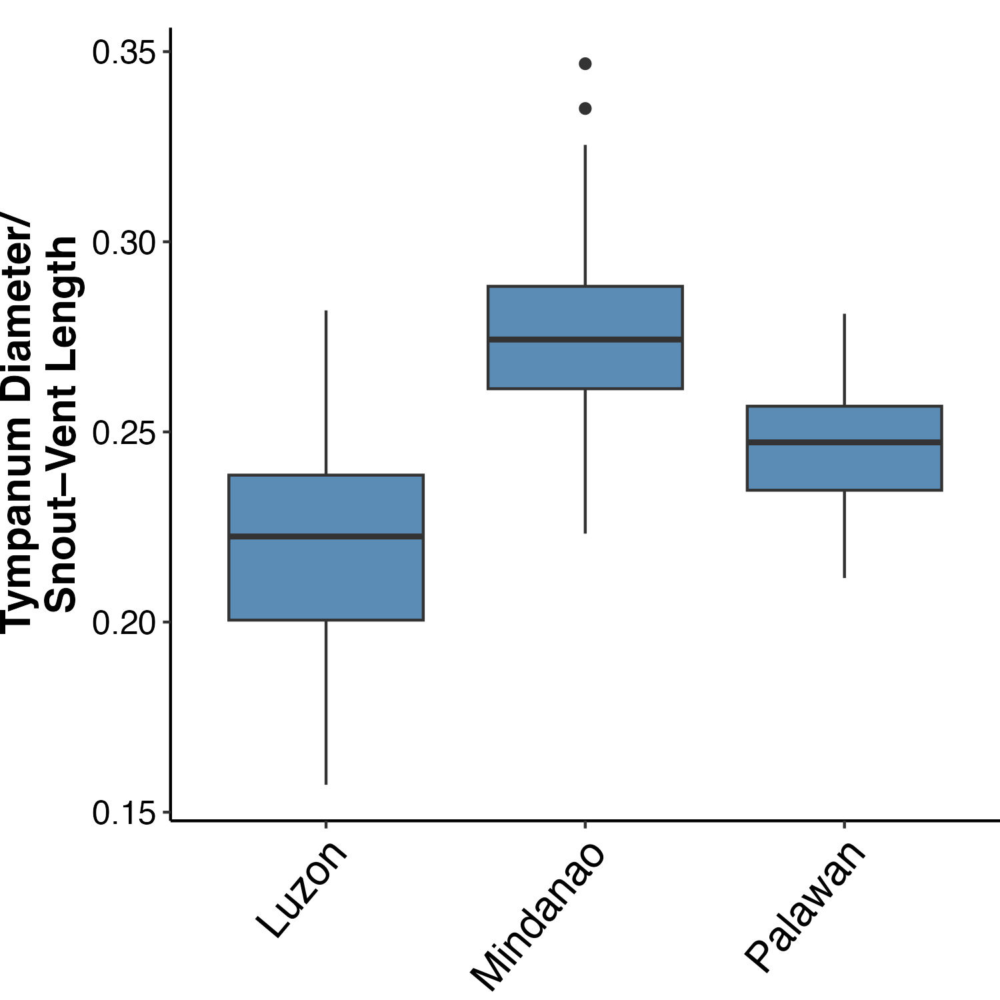
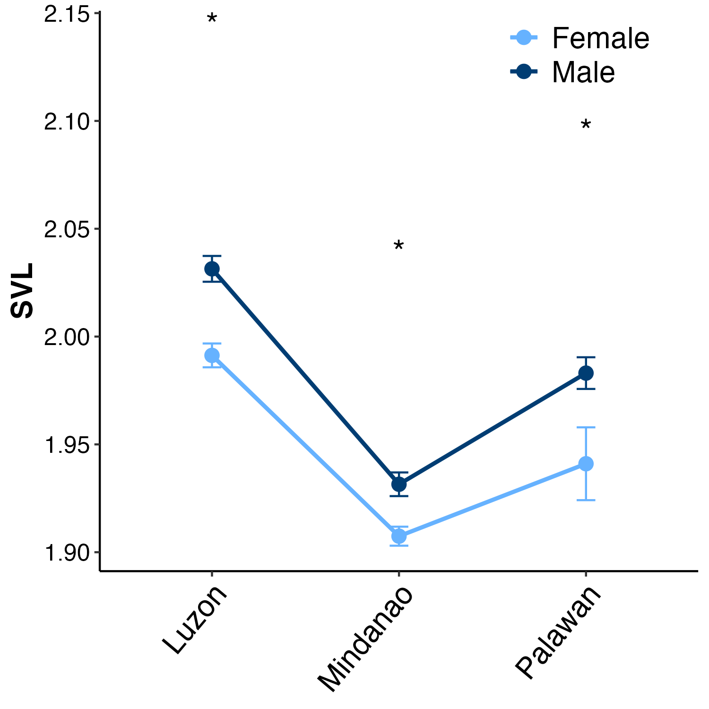
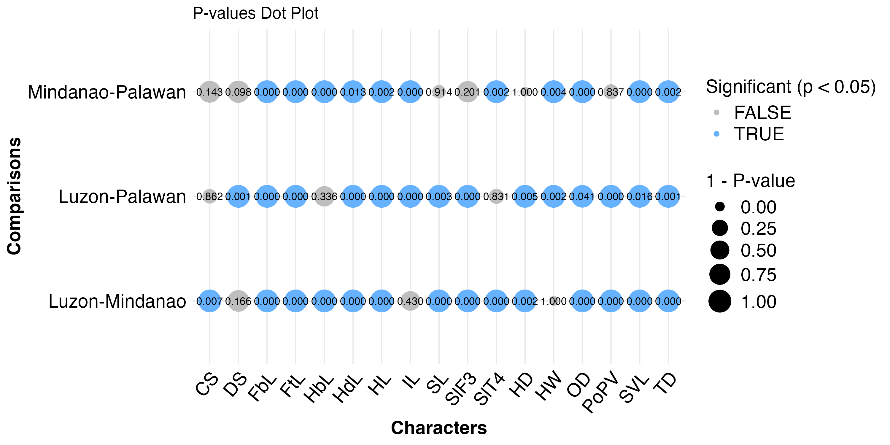
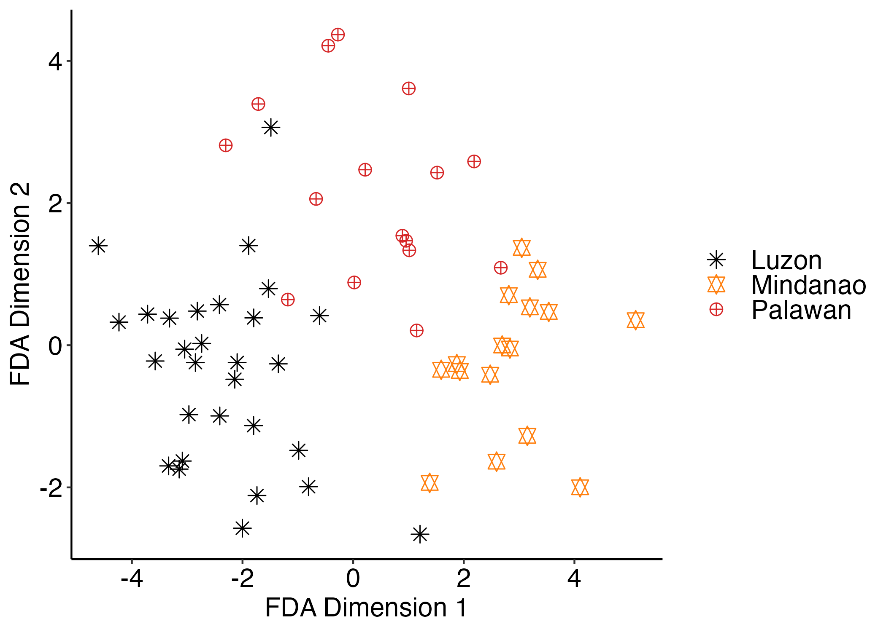
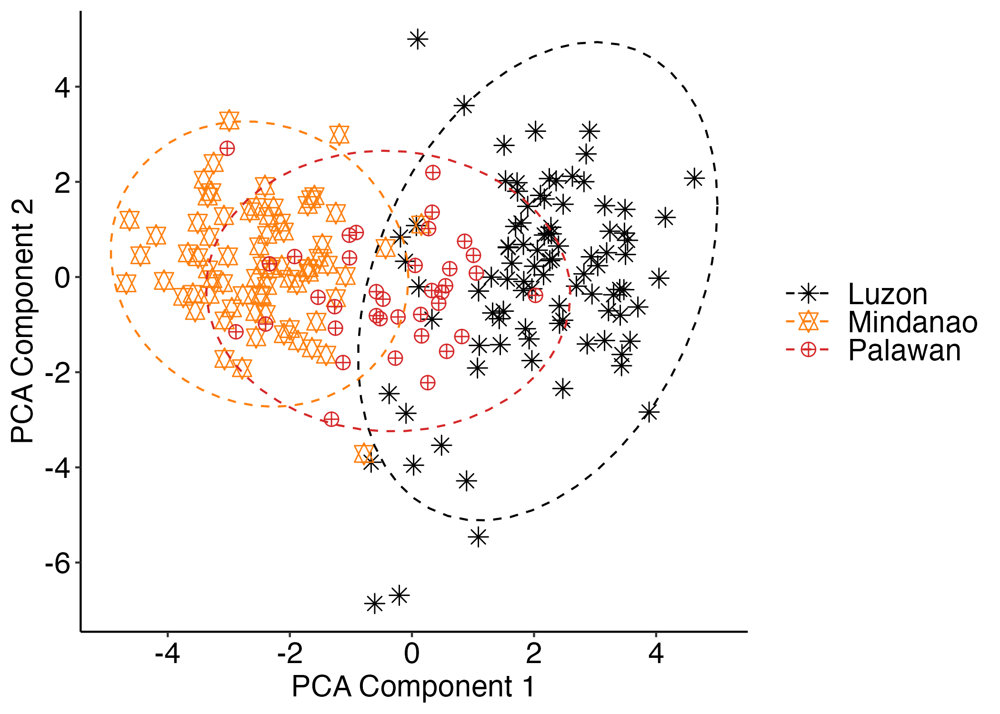
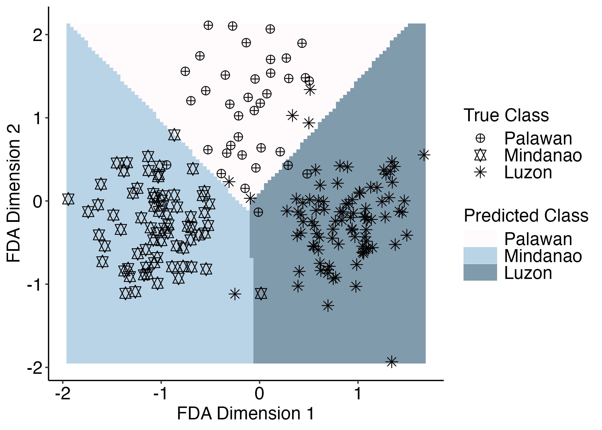
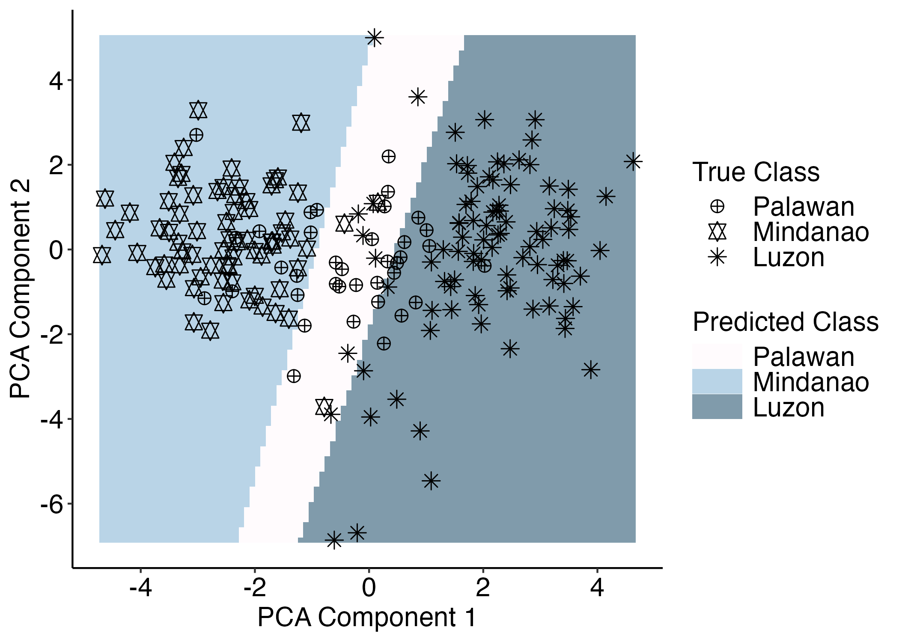

## MorphoTax
This R package contains a collection of functions compiled to provide a transparent and reproducible pipeline for analyzing morphological data in taxonomic studies. The package generally follows the statistical hypothesis testing framework provided by [Chan and Grismer (2021)](https://mapress.com/zt/article/view/zootaxa.5023.2.9). The pipeline includes the following major steps: 

* **Data filtering**. Four filtering processes can be conducted: (a) removal of samples with missing data and non-numeric values; (b) removal of populations with small sample sizes; (c) removal of juveniles; and (d) removal of outliers using the interquartile range method.

* **Data transformation**. Before performing any statistical analyses, it is important to adjust morphological data, especially mensural characters, to eliminate the effects of body size variation (i.e., allometric effect). The package specifically implements the allometric formula used by [Thorpe (1975)](https://onlinelibrary.wiley.com/doi/abs/10.1111/j.1095-8312.1975.tb00732.x). There are three adjustments that can be made: (a) Single population—this option considers all data from one (putative) species, where an overall mean is used to calculate a single slope; (b) Multiple population—this option considers all data from one species, while the slope is calculated for each population using an overall mean; and (c) Species—this option considers each unique group as a single species, where the slope is calculated for each using their respective mean. These three allometric adjustments were adopted from [Chan and Grismer (2022)](https://mapress.com/zt/article/view/zootaxa.5124.4.4).

* **Data Summary**. Two functions are available. The first function offers summary statistics, including the total number of samples, minimum, maximum, mean, standard deviation, and interquartile range for each morphological character across populations. The second function computes and summarizes the ratio of selected characters. This ratio summary features the count and percentage of specimens with a (e.g., SVL/Tail) ratio greater or less than 1, in addition to the range (minimum–maximum), mean, and standard deviation. It also calculates the relative percent difference (e.g., [SVL-Tail]/Tail * 100). These summary statistics are essential for presenting diagnostic characters.

* **Test for normality and homogeneity of variance**. The functions for testing normality and homogeneity of variance are designed to conduct the tests when sex data is considered within each population (this is particularly useful prior to testing sexual dimorphism) and when it is not. Currently, only the Shapiro-Wilk Test (for normality testing) and Levene's Test (for homogeneity of variance) are available.

* **Test for sexual dimorphism**. When sex data is available, it is crucial to first check for sexual dimorphism. This assessment will decide whether separate analyses are needed for male and female datasets. Two tests are included: the T-test and the Wilcoxon Test. When the test is performed, it is conducted simultaneously for each population or group. An option to apply the tests to all character is also available.

* **Univariate analysis**. ANOVA and Kruskal-Wallis tests are available for testing differences in characters with equal and unequal variance, respectively. The functions for these tests wrap existing R functions (*anova*, *kruskal.test*), with the only difference being that they apply to all characters across populations. The package also automates Tukey and Dunn's tests when significant results are detected in a given character. Additionally, it includes a function that compiles all p-values from these tests into a single table.

* **Multivariate analysis**. Currently, only Principal Component Analysis (PCA) and Flexible Discriminant Analysis (FDA) are available. We opted to include FDA, which is an extension of the commonly used Linear Discriminant Analysis (LDA), due to its flexibility in handling non-normally distributed, complex data that is not linearly separable (see [Hastie et al. 1999](https://doi.org/10.1080/01621459.1994.10476866)). This makes it ideal for morphological datasets, which often comprise of characters that do not meet the assumptions of LDA. Results, such as loadings in the case of PCA and confusion matrices and variable coefficients for FDA, can be automatically written to CSV files.

* **Test for species boundaries in morphological space**. Testing species boundaries in morphological space is often conducted using various statistical analyses such as PCA, Discriminant Function Analysis, and K-means Clustering. However, these methods can be challenging, particularly when applied to closely related organisms with little to no morphological differences, which often result in overlapping clusters of samples. Here, we explored the implementation of Support Vector Machine on the first two dimensions of PCA and FDA. SVM is a supervised classification algorithm that partitions samples into classes by searching for the optimal hyperplane margin that maximizes the boundary among classes (in this case, putative species) in two or more dimensions (see [Boser et al. 1992](https://dl.acm.org/doi/10.1145/130385.130401); [Cortes and Vapnik 1995](https://doi.org/10.1007/BF00994018)). The result of the analysis features a biplot identical to PCA and FDA, but it also includes polygons indicating the boundaries of the predicted classes or putative species.  

### Citation
The full implementation of the package is documented in our recent work on Philippine Green Crested Lizards. Please cite this study when using the package:

Supsup, C.E., Pitogo, K.M.P., Sanguila, M.B., Hallermann, J., Denzer, W., Wood Jr, P.L., and Brown, R.M. (Accepted). A Comprehensive, Archipelago-Wide Taxonomic Re-assessment of the Genus *Bronchocela* (Squamata: Agamidae) in the Philippines, with Descriptions of Two New
Species. Herpetological Monographs.

### Installation
```r
## Check and install required packages
req.pkgs <- c("devtools", "ggplot2", "tibble", "dplyr", "car", "mda", "psych", "magrittr", "caret",
 "RColorBrewer", "Rmisc", "rlang", "reshape2")

for (pkg in req.pkgs) {
  if (!requireNamespace(pkg, quietly = TRUE)) {
    install.packages(pkg)
  }
  library(pkg, character.only = TRUE)
}

## Install "MorphoTax"
install_github("csupsup/MorphoTax")
```
### Using the package
For a hands-on demonstration, we have included sample data (herp.data.csv), a subset of the data from our study. When using the package, make sure your data matches this format:

| Pop     | Sex |   SVL |   TD |   OD |   HW |   HD |   HL |  HdL |  FbL |  FtL |  HbL |
|---------|-----|-------|------|------|------|------|------|------|------|------|------|
| Palawan | m   | 74.44 | 2.52 | 6.85 |10.35 | 9.61 |20.61 |15.06 |40.20 |28.12 |66.55 |
| Palawan | f   | 75.74 | 2.53 | 6.72 |11.14 | 9.84 |20.16 |12.70 |36.40 |27.71 |65.88 |
| Palawan | f   | 80.87 | 2.66 | 7.16 |11.43 |10.47 |23.03 |15.00 |43.50 |28.80 |69.12 |
| Palawan | m   | 83.81 | 2.90 | 7.38 |11.28 |10.31 |22.87 |15.05 |41.58 |31.87 |73.18 |

#### Load the package and access the sample data
```r
## Load the package
library("MorphoTax")

## Access the data
data <- read.csv(system.file("extdata", "herp.data.csv", package = "MorphoTax"))

## If you need help with a specific function
?run_fda_svm
```

### 1. Data filtering
* Remove samples with missing data and non-numeric values.
```r
filtered.data <- remove_non_num(data, cols.range = 3:ncol(data), sum = TRUE)
# Number of samples removed: 0 
# Remaining number of samples: 202 
# Removed sample names:
# character(0)
```
* Remove populations with small sample sizes. Default threshold is 4 samples per population.
```r
filtered.data <- remove_pop(filtered.data, grp = "Pop", threshold = 4)
# No populations were removed. All populations have at least 4 individuals.
```
* Remove juveniles. The basis for removing juveniles here is SVL, with a threshold of 70 mm. Therefore, this will remove samples with less than 70 mm SVL. Adjust the threshold according to your data.
```r
filtered.data <- remove_juv(filtered.data, char = "SVL", threshold = 70, sum = TRUE)
# Number of samples removed: 0 
```
* Remove outliers by using the interquartile range method with SVL as a reference character. We recommend performing this step after addressing the allometric effects (see below). Adjust the percentiles (i.e., q1, q3) as needed.
```r
filtered.data <- remove_outliers(filtered.data , char = "SVL", grp = "Pop", q1 = 0.25, q3 = 0.75)
# Outlier removal applied per Pop.
# Group 'Luzon' removed 0 samples.
# Group 'Mindanao' removed 1 samples.
# Group 'Palawan' removed 0 samples.
```

### 2. Data transformation
The sample data consists of both mensural and meristic (countable traits) data. Apply only the removal of allometric effects to mensural data.
```r
## Get mensural data (columns 1–12)
mensural <- subset(filtered.data, select = c(1:12))

head(mensural)
#     Pop Sex   SVL   TD   OD    HW    HD    HL   HdL   FbL   FtL   HbL
# 1 Luzon   f 80.19 2.16 6.74 11.90 10.41 21.79 17.42 43.38 32.04 73.12
# 2 Luzon   f 83.20 2.24 7.07 11.93 10.29 21.67 15.61 43.71 29.35 69.89
# 3 Luzon   f 83.26 2.51 7.18 11.04 10.55 21.61 16.32 41.24 29.47 66.18
# 4 Luzon   f 83.36 2.23 6.99 11.92 11.63 22.65 16.91 45.32 32.17 73.17
# 5 Luzon   f 83.72 2.55 6.61 11.97 10.27 21.26 17.09 44.19 31.56 73.12
# 6 Luzon   f 84.26 2.39 7.37 11.26 10.71 22.05 19.85 46.09 31.66 71.88

mensural$Sex <- NULL ## Exclude sex data

## Apply the adjustment
adj.data <- adjust_morph(mensural, type = "multi_pop") # Use multi-population option. Adjust according to your data

head(adj.data)
#     Pop      SVL        TD        OD       HW       HD       HL      HdL
# 1 Luzon 1.904120 0.4069708 0.8876584 1.154723 1.092703 1.418329 1.294251
# 2 Luzon 1.920123 0.4055793 0.8944359 1.137052 1.069833 1.396954 1.233998
# 3 Luzon 1.920436 0.4546687 0.9008673 1.103014 1.080322 1.395379 1.253068
# 4 Luzon 1.920958 0.4027401 0.8887646 1.135710 1.122068 1.415174 1.268081
# 5 Luzon 1.922829 0.4589655 0.8628537 1.135333 1.065973 1.385450 1.271205
# 6 Luzon 1.925621 0.4278247 0.9076802 1.105504 1.081080 1.397984 1.334023

## Combine back the adjusted mensural data and meristic data
cleaned.data <- cbind(adj.data, filtered.data[13:ncol(filtered.data)])
```

### 3. Data summary
When obtaining summary statistics, it is entirely your choice whether to use the data with adjusted or raw mensural characters. For this example, let us use the data with adjusted mensural characters.
```r
## Summary statistics
sum.res <- summarize_morph(cleaned.data, grp = "Pop")

head(sum.res)
#     pop char  n    min median    max         mean_sd     iqr_range
# 1 Luzon  SVL 93 1.9041 2.0180 2.0923 2.0064 ± 0.0441 1.9797–2.0359
# 2 Luzon   TD 93 0.3091 0.4410 0.5716 0.4459 ± 0.0507 0.4063–0.4792
# 3 Luzon   OD 93 0.7971 0.8931 0.9630 0.8941 ± 0.0276 0.8756–0.9116
# 4 Luzon   HW 93 1.0578 1.1201 1.2236 1.1218 ± 0.0298 1.1047–1.1386
# 5 Luzon   HD 93 1.0097 1.0641 1.1439 1.0671 ± 0.0268 1.0473–1.0823
# 6 Luzon   HL 93 1.3576 1.3970 1.5169 1.4006 ± 0.0243 1.3854–1.4127

## Compute and summarize ratios. Ensure that you assign the numerator (char.as.num) and the denominator (char.as.den). Let us use TD (tympanum diameter) and SVL.
ratio.sum <- summarize_ratio(cleaned.data, char.as.num = "TD", char.as.den = "SVL", grp = "Pop")

head(ratio.sum)
#        pop  n longCount shortCount longPct shortPct longRange   shortRange
# 1    Luzon 93         0         93       0      100        NA 0.28 to 0.16
# 2 Mindanao 71         0         71       0      100        NA 0.35 to 0.22
# 3  Palawan 37         0         37       0      100        NA 0.28 to 0.21
#   meanLongRatio sdLongRatio meanShortRatio sdShortRatio
# 1           NaN          NA      0.2223590   0.02571428
# 2           NaN          NA      0.2753895   0.02490564
# 3           NaN          NA      0.2467993   0.01662235
#                          shortRdiff longRdiff
# 1 TD is 72% to 84% shorter than SVL        NA
# 2 TD is 65% to 78% shorter than SVL        NA
# 3 TD is 72% to 79% shorter than SVL        NA

## Visualize TD/SVL ratio
box <- plot_ratio_box(cleaned.data, char.as.num = "TD", char.as.den = "SVL", grp = "Pop", 
                y.title = "Tympanum Diameter/\nSnout–Vent Length")
box
ggsave("td.svl.boxplot.png", plot = box, width = 5, height = 5, dpi = 300)
```


### 4. Test for normality and homogeneity of variance
As mentioned above, functions are provided to perform these tests when sex data is available (*shapiro_sex*, *levene_sex*) and when it is not (*shapiro_all*, *levene_all*).
```r
## Add sex information to the cleaned dataset
sex.cleaned.data <- cbind(cleaned.data, filtered.data$Sex) # Sex is added to the last column
colnames(sex.cleaned.data)[ncol(sex.cleaned.data)] <- "Sex" # Rename the sex column

head(sex.cleaned.data)
#     Pop      SVL        TD        OD       HW       HD       HL      HdL
# 1 Luzon 1.904120 0.4069708 0.8876584 1.154723 1.092703 1.418329 1.294251
# 2 Luzon 1.920123 0.4055793 0.8944359 1.137052 1.069833 1.396954 1.233998
# 3 Luzon 1.920436 0.4546687 0.9008673 1.103014 1.080322 1.395379 1.253068
# 4 Luzon 1.920958 0.4027401 0.8887646 1.135710 1.122068 1.415174 1.268081
# 5 Luzon 1.922829 0.4589655 0.8628537 1.135333 1.065973 1.385450 1.271205
# 6 Luzon 1.925621 0.4278247 0.9076802 1.105504 1.081080 1.397984 1.334023
#        FbL      FtL      HbL LbS DS PoPV SL IL SlF3 SlT4 NS CS Sex
# 1 1.692676 1.548643 1.913608  50 35    4 11 12   30   36 11  6   f
# 2 1.682841 1.500380 1.882238  49 30    3  9  9   25   30 12  6   f
# 3 1.657322 1.501953 1.858320  46 30    4 10 10   28   32  9  6   f
# 4 1.697866 1.539692 1.901544  53 32    4 10 10   28   32  9  7   f
# 5 1.685365 1.530188 1.899873  56 34    2 10 11   27   32 10  6   f
# 6 1.701357 1.529786 1.890395  48 36    4 10 11   29   34 12  6   f

## Perform Shapiro-Wilk test by sex
shapiro.res <- shapiro_sex(sex.cleaned.data, sex = "Sex", grp = "Pop")

head(shapiro.res)
#     pop sex char shapiro.stat shapiro.pvalue significance
# 1 Luzon   f  SVL    0.9488428   1.610459e-02            *
# 2 Luzon   f   TD    0.9542124   2.850380e-02            *
# 3 Luzon   f   OD    0.9589719   4.774296e-02            *
# 4 Luzon   f   HW    0.9624504   6.989721e-02             
# 5 Luzon   f   HD    0.9692274   1.472317e-01             
# 6 Luzon   f   HL    0.8348251   1.556124e-06            *

## Shapiro-Wilk test without sex data
shapiro.res <- shapiro_all(cleaned.data, grp = "Pop") # Use "cleaned.data" here

head(shapiro.res)
#     pop char shapiro.stat shapiro.pvalue significance
# 1 Luzon  SVL    0.9656510   1.501378e-02            *
# 2 Luzon   TD    0.9811216   1.984421e-01             
# 3 Luzon   OD    0.9702799   3.216383e-02            *
# 4 Luzon   HW    0.9671068   1.903779e-02            *
# 5 Luzon   HD    0.9701183   3.130964e-02            *
# 6 Luzon   HL    0.8725513   2.023374e-07            *

## Perform Levene's test by sex
levene.res <- levene_sex(sex.cleaned.data, sex = "Sex", grp = "Pop")

head(levene.res)
#     pop char     F.value    p.value significance
# 1 Luzon  SVL 1.908969615 0.17046051             
# 2 Luzon   TD 0.002634629 0.95917615             
# 3 Luzon   OD 3.642243429 0.05948311             
# 4 Luzon   HW 4.780579668 0.03134770            *
# 5 Luzon   HD 3.844761020 0.05295954             
# 6 Luzon   HL 1.754550535 0.18862262     

## Perform Levene's test without sex data 
levene.res <- levene_all(cleaned.data, grp = "Pop")

head(levene.res)
#   char  F.value     p.value significance
# 1  SVL 3.738594 0.025483320            *
# 2   TD 4.762689 0.009545608            *
# 3   OD 3.970034 0.020394336            *
# 4   HW 4.511511 0.012134115            *
# 5   HD 3.420796 0.034630433            *
# 6   HL 2.998711 0.052120732             
```

### 5. Test for sexual dimorphism
The test can be performed using a single character (e.g., char = “SVL”) or applied to all (all = TRUE). Ensure that you use the data with sex information.
```r
## Filter data by excluding populations represented by only one sex
sex.cleaned.data <- filter_sex(sex.cleaned.data)

sex.cleaned.data <- filter_sex(sex.cleaned.data)
# Initial sex counts:
#           
#             f  m
#   Luzon    58 35
#   Mindanao 51 20
#   Palawan   8 29
# 
# No populations removed for having only one sex represented.
# 
# Filtered sex counts (after removing populations with only one sex represented):
#          
#             f  m
#   Luzon    58 35
#   Mindanao 51 20
#   Palawan   8 29

# No populations removed for having fewer than 4 samples for each sex.
# 
# Filtered sex counts (after filtering populations with less than 4 samples per sex):
#           
#             f  m
#   Luzon    58 35
#   Mindanao 51 20
#   Palawan   8 29

## T-test with a single character
t.test.res <- t_test_sex(sex.cleaned.data, sex = "Sex", char = "SVL", grp = "Pop", all = FALSE)

head(t.test.res)
#   char      pop    T.stat   F.value      p.value significance
# 1  SVL    Luzon -4.926788 81.424399 4.320715e-06            *
# 2  SVL Mindanao -3.421488 44.386686 1.347883e-03            *
# 3  SVL  Palawan -2.282502  9.813006 4.606485e-02            *

## Visualize the result with error bar. Asterisk denotes significant result.
svl.bar <- plot_errorbar(sex.cleaned.data, char = "SVL", sex = "Sex", grp = "Pop", test = "t-test")

svl.bar

## Write plot to a png file
ggsave("svl.errorbar.png", plot = svl.bar, width = 5, height = 5, dpi = 300)
```


```r
## T-test with all characters
t.test.res <- t_test_sex(sex.cleaned.data, sex = "Sex", grp = "Pop", all = TRUE) # Set TRUE here

head(t.test.res)
#   char      pop     T.stat   F.value      p.value significance
# 1  SVL    Luzon -4.9267883 81.424399 4.320715e-06            *
# 2  SVL Mindanao -3.4214875 44.386686 1.347883e-03            *
# 3  SVL  Palawan -2.2825017  9.813006 4.606485e-02            *
# 4   TD    Luzon  2.1925203 71.024443 3.161966e-02            *
# 5   TD Mindanao  1.2798296 33.719788 2.093407e-01             
# 6   TD  Palawan  0.6131269 11.514095 5.517113e-01        
```
For the Wilcoxon test, simply replace the function "t_test_sex" with "wilcox_test_sex". The arugement is the same.

### 6. Univariate analysis
Before doing any univariate analysis, make sure each morphological character meets the necessary conditions for the test (e.g., equal variance for ANOVA). See the tutorial for details on the tests for normality and homogeneity of variance mentioned above.
```r
## Identify which characters have unequal variances according to Levene's test
sig.morphs.f <- levene.res[levene.res$significance == "*", "char"]

## These characters do not fulfill the assumptions of ANOVA; therefore, they should be tested with non-parametric Kruskal-Wallis test.

sig.morphs.f
# [1] "SVL"  "TD"   "OD"   "HW"   "HD"   "LbS"  "PoPV"

## Remove these characters from the cleaned dataset to perform ANOVA.
df.eqvar <- cleaned.data[, !(names(cleaned.data) %in% sig.morphs.f)]

## Check columns
colnames(df.eqvar)
#  [1] "Pop"  "HL"   "HdL"  "FbL"  "FtL"  "HbL"  "DS"   "SL"   "IL"   "SlF3"
# [11] "SlT4" "NS"   "CS" 

## Create an ouput directory for Tukey test results
dir.create("tk_morph")

## Perform ANOVA
## Take note that this function automates the Tukey test when significant results is detected in ANOVA
aov.res <- anova_tukey(df.eqvar, grp = "Pop", write.tk = TRUE, dir = "tk_morph/") # Provide the newly created output directory

## ANOVA and Tukey test results are stored in a list

## Access ANOVA results
aov.res$aov_summary
#    char DF    F.value      p.value
# 1    HL  2  47.033184 1.937226e-17
# 2   HdL  2 129.179364 1.254654e-36
# 3   FbL  2 134.072236 1.535750e-37
# 4   FtL  2  69.868600 1.097850e-23
# 5   HbL  2  88.333252 3.793254e-28
# 6    DS  2   6.794118 1.400211e-03
# 7    SL  2  12.650801 6.754013e-06
# 8    IL  2  17.442754 1.053780e-07
# 9  SlF3  2  39.724098 3.124966e-15
# 10 SlT4  2  14.175062 1.764253e-06
# 11   NS  2   3.038228 5.015987e-02
# 12   CS  2   4.913599 8.266427e-03

## Access Tukey test results. The matrix below displays the adjusted p-value for each comparison across characters
aov.res$tukey_padj_matrix
#         Comparison           HL          HdL          FbL          FtL
# 1   Mindanao-Luzon 6.938894e-14 4.118927e-14 4.118927e-14 4.507505e-14
# 2    Palawan-Luzon 8.942500e-05 7.016610e-14 1.993017e-11 2.657034e-05
# 3 Palawan-Mindanao 2.269832e-03 1.275861e-02 1.603215e-07 8.883223e-06
#            HbL          DS           SL           IL         SlF3         SlT4
# 1 4.141132e-14 0.165504308 0.0000159247 4.299965e-01 7.627232e-14 1.788720e-06
# 2 3.361674e-01 0.001009049 0.0025670696 6.233753e-08 1.562643e-06 8.307624e-01
# 3 7.671641e-14 0.097742753 0.9144000667 1.916238e-05 2.014401e-01 1.944965e-03
#   NS          CS
# 1 NA 0.006714596
# 2 NA 0.861799944
# 3 NA 0.143210546
```
Note that the result for every character comparison is also written to your "tk_morph" directory as a CSV file. These CSV files are needed when you want to combine the results of both Tukey and Dunn's test to summarize the comparisons.
```r
## Perform Kruskal-Wallis test on characters with unequal variance
chars <- c("Pop", sig.morphs.f) 
df.unvar <- cleaned.data[, chars] # Retain "Pop" column along with character with unequal variance

## Check columns
colnames(df.unvar)
# [1] "Pop"  "SVL"  "TD"   "OD"   "HW"   "HD"   "LbS"  "PoPV"

## Create an ouput directory for Dunn's test results
dir.create("dn_morph")

kw.res <- kw_dunn(df.unvar, grp = "Pop", write.dunn = TRUE, dir = "dn_morph/")

## Access the results
kw.res$kruskal_summary
#   char KW Statistic      p.value
# 1  SVL   105.301348 1.361767e-23
# 2   TD    79.382594 5.784804e-18
# 3   OD    49.241279 2.029514e-11
# 4   HW    13.339213 1.268898e-03
# 5   HD    15.847336 3.620719e-04
# 6  LbS     2.418135 2.984755e-01
# 7 PoPV    88.679721 5.539151e-20

kw.res$dunn_padj_matrix
#           Comparison          SVL           TD           OD          HW
# 1   Luzon - Mindanao 4.529877e-24 1.783754e-18 3.806947e-07 1.000000000
# 2    Luzon - Palawan 1.560490e-02 8.454877e-04 4.055288e-02 0.001701350
# 3 Mindanao - Palawan 4.092890e-07 1.803663e-03 2.860598e-10 0.003552056
#            HD LbS         PoPV
# 1 0.002141835  NA 2.116347e-18
# 2 0.004883225  NA 3.937563e-09
# 3 1.000000000  NA 8.369398e-01
```
Combine all the results from Tukey and Dunn's tests.
```r
## Get and combine all p-values from individual results
cleaned.pval <- clean_pvals(tk.dir = "tk_morph/", dn.dir = "dn_morph/", 
                    output.file = "cleaned_pvals.csv", asterisk = TRUE)

## View results 
head(cleaned.pval)
#        comparisons     CS     DS    FbL    FtL    HbL    HdL     HL     IL
# 1   Luzon-Mindanao 0.007*  0.166 0.000* 0.000* 0.000* 0.000* 0.000*  0.430
# 2    Luzon-Palawan  0.862 0.001* 0.000* 0.000*  0.336 0.000* 0.000* 0.000*
# 3 Mindanao-Palawan  0.143  0.098 0.000* 0.000* 0.000* 0.013* 0.002* 0.000*
#       SL   SlF3   SlT4     HD     HW     OD   PoPV    SVL     TD
# 1 0.000* 0.000* 0.000* 0.002*  1.000 0.000* 0.000* 0.000* 0.000*
# 2 0.003* 0.000*  0.831 0.005* 0.002* 0.041* 0.000* 0.016* 0.001*
# 3  0.914  0.201 0.002*  1.000 0.004* 0.000*  0.837 0.000* 0.002*

## The asterisk indicates a significant result. You can disable this by setting "asterisk = FALSE"
```
Visualize the comparisons.
```r
## Get combined p-values without asterisks
cleaned.pval <- clean_pvals(tk.dir = "tk_morph/", dn.dir = "dn_morph/", 
                    output.file = "cleaned.pvals.csv", asterisk = FALSE)

## Assign comparisons column as rownames
rownames(cleaned.pval) <- cleaned.pval[[1]]
cleaned.pval <- cleaned.pval[ , -1]

pval <- plot_pval(cleaned.pval, dot.val = TRUE)

pval

## Write plot
ggsave("pval.dotplot.png", plot = pval, width = 10, height = 5, dpi = 300)
```


### 7. Multivariate analysis
When you perform FDA and PCA, use the dataset that passed through all of the filtering processes above. Make sure to remove the "Sex" column or subset the data if independent analysis is needed for each sex.

* Perform FDA using the "cleaned.data". The argument below will generate the confusion matrix (con.mat), discriminant coefficients (coef), and classification accuracy (acc). These outputs are automatically saved as CSV files. The "split" option will allocate 70% of the data for training and the remaining 30% for testing. Adjust this as necessary.
```r
fda.res <- run_fda(cleaned.data, con.mat = TRUE, coef = TRUE, accu = TRUE, split = 0.7)
# [1] "Confusion matrix file written: fda_conf_mat_cleaned.data.csv"
# [1] "Coefficient file written: fda_coef_cleaned.data.csv"
# [1] "FDA Classification Accuracy on Test Data: 93.44 %"

## Access the results
fda.res$ # Press the tab key on your keyboard to view all the outputs
# fda.res$accuracy       fda.res$accuracy_data  fda.res$coef           fda.res$con.mat        fda.res$fda.model

## Confusion matrix
fda.res$con.mat
#           test_pred
#            Luzon Mindanao Palawan
#  Luzon       26        1       0
#  Mindanao     1       26       0
#  Palawan      0        2       5

## Plot FDA

## Assign custom shapes and colors
point.shape <- c("Luzon" = 8, "Mindanao" = 11, "Palawan" = 10)
point.color <- c("Luzon" = "#000000", "Mindanao" = "#FF7F0E", "Palawan" = "#D62728")

fda.plot <- plot_fda(cleaned.data, point.color = point.color, 
                               fixed.shape = point.shape, split = 0.7, accu = TRUE)
fda.plot

## Write plot 
ggsave("fda.plot.png", plot = fda.plot, width = 7, height = 5, dpi = 300)
```


* For PCA, the output includes the proportion of variance (prop.var), variable loadings (var.load), and PCA scores (pc.scores). Similar to FDA, these are automatically saved as CSV files. 
```r
pca.res <- run_pca(cleaned.data, prop.var = TRUE, var.load = TRUE, pc.scores = TRUE)
# PC1 variance explained:28.62 %
# PC2 variance explained:14.04 %
# Variable loadings written to:pca_varload_cleaned.data.csv %
# New names:
# • `` -> `...20`
# Principal component scores written to:pca_pcscores_cleaned.data.csv %

## Access the results
pca.res$
# pca.res$ax1.var        pca.res$ax2.var        pca.res$pca.pc.scores  pca.res$pca.var.load 

pca.res$pca.var.load
# A tibble: 19 × 20
#    char       PC1     PC2     PC3     PC4     PC5     PC6       PC7      PC8
#    <chr>    <dbl>   <dbl>   <dbl>   <dbl>   <dbl>   <dbl>     <dbl>    <dbl>
#  1 SVL    0.312   -0.0440  0.0143  0.0991 -0.0734 -0.0871  0.198    -0.293  
#  2 TD    -0.297   -0.118  -0.0687 -0.0850 -0.0324  0.0344 -0.0441    0.0809 
#  3 OD    -0.161   -0.244  -0.297  -0.198   0.142   0.390  -0.243     0.0421 

## Plot PCA

pca.plot <- plot_pca(cleaned.data, point.color = point.color, 
                               fixed.shape = point.shape)
pca.plot

## Write plot
ggsave("pca.plot.png", plot = pca.plot, width = 7, height = 5, dpi = 300)
```


### 8. Test for species boundaries in morphological space.
We treat the delimitation of species boundaries in morphological space as a classification problem, which therefore requires a classification method. Here, we use the Support Vector Machine (SVM) algorithm to predict the number of classes or putative species. The SVM is implemented using the first two dimensions of FDA and PCA, which contain the most information on morphological data when reduced to lower dimensions. This way, noise from the data is minimized, allowing the SVM to perform well. Note that the function implements a 10-fold cross-validation to evaluate model performance.

* Perform SVM on FDA
```r
## Assign custom shapes and colors
point.shape <- c("Luzon" = 8, "Mindanao" = 11, "Palawan" = 10)
point.color <- c("Luzon" = "#000000", "Mindanao" = "#FF7F0E", "Palawan" = "#D62728")

## Oder the labels
pop <- c("Palawan", "Mindanao", "Luzon")

fda.svm <- run_fda_svm(cleaned.data, point.shape = point.shape, class.color = NULL, pop.order = pop)
# Loading required package: lattice
# Support Vector Machines with Linear Kernel 
#
# 201 samples
#   2 predictor
#   3 classes: 'Palawan', 'Mindanao', 'Luzon' 
#
# No pre-processing
# Resampling: Cross-Validated (10 fold) 
# Summary of sample sizes: 180, 180, 181, 182, 181, 181, ... 
# Resampling results:
# 
#   Accuracy   Kappa    
#   0.9446867  0.9116103
#
# Tuning parameter 'C' was held constant at a value of 1
# Confusion Matrix and Statistics
#
#           Reference
# Prediction Palawan Mindanao Luzon
#   Palawan       33        0     5
#   Mindanao       1       70     1
#   Luzon          3        1    87
# 
# Overall Statistics
#                                           
#                Accuracy : 0.9453          
#                  95% CI : (0.9042, 0.9724)
#     No Information Rate : 0.4627          
#     P-Value [Acc > NIR] : <2e-16          
#                                          
#                   Kappa : 0.913           
#                                          
#  Mcnemar's Test P-Value : 0.6823          
# 
# Statistics by Class:
#
#                      Class: Palawan Class: Mindanao Class: Luzon
# Sensitivity                  0.8919          0.9859       0.9355
# Specificity                  0.9695          0.9846       0.9630
# Pos Pred Value               0.8684          0.9722       0.9560
# Neg Pred Value               0.9755          0.9922       0.9455
# Prevalence                   0.1841          0.3532       0.4627
# Detection Rate               0.1642          0.3483       0.4328
# Detection Prevalence         0.1891          0.3582       0.4527
# Balanced Accuracy            0.9307          0.9853       0.9492

## Plot
fda.svm

## Write plot
ggsave("fda.svm.png", plot = fda.svm, width = 7, height = 5, dpi = 300)
```


* Perform SVM on PCA
```r
pca.svm <- run_pca_svm(cleaned.data, point.shape = point.shape, class.color = NULL, pop.order = pop)
# PC1 variance explained: 28.62%
# PC2 variance explained: 14.04%
# Support Vector Machines with Linear Kernel 
# 
# 201 samples
#   2 predictor
#   3 classes: 'Palawan', 'Mindanao', 'Luzon' 
# 
# No pre-processing
# Resampling: Cross-Validated (10 fold) 
# Summary of sample sizes: 181, 181, 180, 181, 181, 180, ... 
# Resampling results:
# 
#   Accuracy   Kappa    
#   0.8208271  0.7104016
# 
# Tuning parameter 'C' was held constant at a value of 1
# Confusion Matrix and Statistics
# 
#           Reference
# Prediction Palawan Mindanao Luzon
#   Palawan       15        3     8
#   Mindanao      11       68     0
#   Luzon         11        0    85
# 
# Overall Statistics
#                                           
#                Accuracy : 0.8358          
#                  95% CI : (0.7772, 0.8842)
#     No Information Rate : 0.4627          
#     P-Value [Acc > NIR] : < 2.2e-16       
#                                           
#                   Kappa : 0.7336          
#                                           
#  Mcnemar's Test P-Value : NA              
# 
# Statistics by Class:
# 
#                      Class: Palawan Class: Mindanao Class: Luzon
# Sensitivity                 0.40541          0.9577       0.9140
# Specificity                 0.93293          0.9154       0.8981
# Pos Pred Value              0.57692          0.8608       0.8854
# Neg Pred Value              0.87429          0.9754       0.9238
# Prevalence                  0.18408          0.3532       0.4627
# Detection Rate              0.07463          0.3383       0.4229
# Detection Prevalence        0.12935          0.3930       0.4776
# Balanced Accuracy           0.66917          0.9366       0.9061

## Plot
pca.svm

## Write plot
ggsave("pca.svm.png", plot = pca.svm, width = 7, height = 5, dpi = 300)
```


Examine the PCA results above. If one were to rely solely on the 95% ellipse, the Palawan samples would not be considered morphologically distinct, as they overlap with those from Luzon and Mindanao. However, when SVM is applied, the Palawan population is predicted to be morphologically unique.